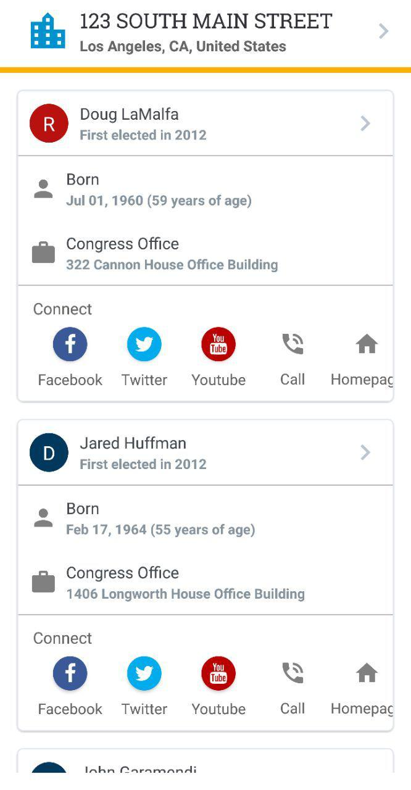

# You Got Owned
**You Got Owned** is a mobile application designed to help you find out how much donation U.S. politicians received based on your current / selected location.

#### Tech Stack
`React Native`, `Redux`

# Screenshot

# Try it on Expo
1. Download the Expo mobile app on the [App Store](https://itunes.apple.com/us/app/expo-client/id982107779) or [Play Store](https://play.google.com/store/apps/details?id=host.exp.exponent)
2. Clone this repository on your local computer. `git clone git@github.com:byeong0430/you-got-owned.git`
3. Install all dependencies. `npm install`
4. Initiate the Expo app by typing `npm start`. A new page will appear on your browser.
5. Open the Expo app on your mobile device and select `Scan QR Code`
6. Scan the QR code at the bottom-right corner of the new page on your browser.

## Note
To run the application, you need to fetch your own API tokens for the following services

| Service        | URL                                                                                 |
| -------------- | ----------------------------------------------------------------------------------- |
| Open Secrets   | https://www.opensecrets.org/open-data/api                                           |
| Algolia Places | https://community.algolia.com/places/rest.html (`Get Started` button on the bottom) |
